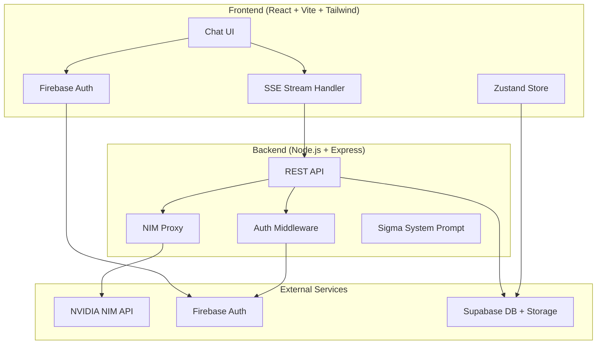

# Sigma — Elite AI Assistant Application

Build a full-stack AI chat application that embodies the Sigma persona: an elite assistant for hackers, developers, and security researchers. The app features a premium dark-mode UI, streaming AI responses via NVIDIA NIM, special command modes, conversation history, and a rich chat experience.

---

## User Review Required

> [!IMPORTANT]
> **API Keys Required**: You'll need to provide:
> 1. **NVIDIA NIM API Key** (`nvapi-...`) from [build.nvidia.com](https://build.nvidia.com)
> 2. **Firebase project config** (API key, auth domain, project ID, etc.)
> 3. **Supabase project config** (URL + anon key)
>
> I'll create `.env` template files — you fill in the real values.

> [!WARNING]
> **Tailwind CSS**: Your system prompt specifies Tailwind CSS. The workspace guidelines default to Vanilla CSS, but since your spec explicitly calls for Tailwind, I'll use **Tailwind CSS v3** with the Vite plugin. Let me know if you prefer v4.

> [!IMPORTANT]
> **Scope for V1**: This plan covers the **full MVP** — chat UI, streaming AI, special modes, auth, conversation persistence, and model selection. The backend proxies NIM API calls to keep the API key server-side. Let me know if you want to adjust scope.

---

## Open Questions

> [!IMPORTANT]
> 1. **Do you have your NVIDIA NIM API key ready?** If not, you can get one free at [build.nvidia.com](https://build.nvidia.com). I'll set up `.env` templates either way.
> 2. **Firebase project**: Do you already have a Firebase project created, or should I include setup instructions?
> 3. **Supabase project**: Same question — existing project or need setup guidance?
> 4. **Deployment**: Should I configure Railway (backend) and Netlify (frontend) deployment configs now, or focus on local dev first?

---

## Architecture Overview



---

## Proposed Changes

### 1. Project Scaffolding

#### [NEW] Root project structure

```
a:\Sigma\
├── client/                 # React + Vite frontend
│   ├── src/
│   │   ├── assets/         # Static assets, fonts
│   │   ├── components/     # Reusable UI components
│   │   │   ├── chat/       # Chat-specific components
│   │   │   ├── auth/       # Auth components
│   │   │   ├── layout/     # Layout components
│   │   │   └── ui/         # Generic UI primitives
│   │   ├── hooks/          # Custom React hooks
│   │   ├── lib/            # Utility libraries (firebase, supabase, api)
│   │   ├── pages/          # Page components
│   │   ├── store/          # Zustand state management
│   │   ├── styles/         # Global styles
│   │   ├── types/          # TypeScript definitions
│   │   ├── App.tsx
│   │   └── main.tsx
│   ├── public/
│   ├── index.html
│   ├── tailwind.config.js
│   ├── postcss.config.js
│   ├── vite.config.ts
│   ├── tsconfig.json
│   └── package.json
├── server/                 # Node.js Express backend
│   ├── src/
│   │   ├── routes/         # API routes
│   │   ├── middleware/     # Auth, rate limiting
│   │   ├── services/      # NIM proxy, Supabase
│   │   ├── config/        # Sigma system prompt, constants
│   │   └── index.ts
│   ├── tsconfig.json
│   └── package.json
├── .env.example
└── README.md
```

---

### 2. Frontend — Core UI Components

#### [NEW] `client/src/styles/index.css`
- Tailwind directives (`@tailwind base/components/utilities`)
- Custom CSS variables for the Sigma color palette
- Global styles: dark mode background, custom scrollbar, selection colors
- Animation keyframes for typing indicator, pulse, glow effects
- Glassmorphism utility classes

#### [NEW] `client/src/components/layout/AppLayout.tsx`
- Full-screen dark layout with sidebar + main chat area
- Responsive: sidebar collapses on mobile
- Glassmorphic sidebar with conversation list
- Top bar with model selector + user avatar

#### [NEW] `client/src/components/chat/ChatView.tsx`
- Main chat container with message list + input area
- Auto-scroll to latest message
- Empty state with Sigma branding and quick-start suggestions
- Keyboard shortcuts (Enter to send, Shift+Enter for newline)

#### [NEW] `client/src/components/chat/MessageBubble.tsx`
- User messages: right-aligned, accent-colored
- Sigma messages: left-aligned, with Sigma avatar, glassmorphic background
- Markdown rendering (react-markdown + syntax highlighting via Prism/Shiki)
- Code blocks with copy button and language label
- Typing indicator animation during streaming
- Timestamp display

#### [NEW] `client/src/components/chat/ChatInput.tsx`
- Auto-resizing textarea
- Send button with hover animation
- Slash command autocomplete dropdown (when user types `/`)
- Model selector dropdown
- Character/token count indicator
- Disabled state while Sigma is responding

#### [NEW] `client/src/components/chat/ModelSelector.tsx`
- Dropdown to pick NIM model
- Models: deepseek-ai/deepseek-v4-flash, deepseek-ai/deepseek-r1, qwen/qwen3.5-122b-a10b, mistralai/mistral-small-4-119b-2603, minimaxai/minimax-m2.7, nvidia/llama-3.3-nemotron-super-49b-v1, google/gemma-4-31b-it
- Each model shows name + best-for tag (e.g., "Best for coding")
- Persisted selection in localStorage

#### [NEW] `client/src/components/chat/SlashCommandMenu.tsx`
- Floating autocomplete menu triggered by `/` at start of input
- Commands: `/ctf`, `/audit`, `/pentest`, `/malware`, `/osint`, `/explain`, `/build`, `/ir`
- Each shows icon + description
- Arrow key navigation + Enter to select

#### [NEW] `client/src/components/chat/CodeBlock.tsx`
- Syntax-highlighted code blocks using `react-syntax-highlighter` with a dark theme
- Copy-to-clipboard button with success animation
- Language label badge
- Line numbers for longer blocks

#### [NEW] `client/src/components/layout/Sidebar.tsx`
- Conversation history list
- "New Chat" button with glow effect
- Search/filter conversations
- Each conversation shows title (auto-generated) + timestamp
- Delete conversation option
- Collapsible on mobile with hamburger toggle

---

### 3. Frontend — State Management

#### [NEW] `client/src/store/chatStore.ts`
- Zustand store for chat state
- State: `conversations[]`, `activeConversationId`, `messages[]`, `isStreaming`, `selectedModel`
- Actions: `sendMessage()`, `createConversation()`, `deleteConversation()`, `setModel()`
- Streaming: append tokens to current message in real-time
- Persist active conversation ID to localStorage

#### [NEW] `client/src/store/authStore.ts`
- Zustand store for auth state
- State: `user`, `isLoading`, `isAuthenticated`
- Actions: `signInWithGoogle()`, `signInWithEmail()`, `signUp()`, `signOut()`
- Firebase auth state listener

---

### 4. Frontend — Libraries & Hooks

#### [NEW] `client/src/lib/firebase.ts`
- Firebase app initialization
- Auth instance export
- Google Auth provider config

#### [NEW] `client/src/lib/supabase.ts`
- Supabase client initialization
- Typed database client

#### [NEW] `client/src/lib/api.ts`
- API client for backend communication
- `streamChat(messages, model)` — SSE stream handler
- `getConversations()`, `saveConversation()`, `deleteConversation()`
- Auth token injection via interceptor

#### [NEW] `client/src/hooks/useStreamResponse.ts`
- Custom hook for handling SSE/streaming responses
- Manages streaming state, buffer, and error handling
- Provides `startStream()`, `stopStream()`, `streamedContent`

---

### 5. Frontend — Pages & Auth

#### [NEW] `client/src/pages/ChatPage.tsx`
- Main page: AppLayout + ChatView
- Protected route (requires auth)

#### [NEW] `client/src/pages/AuthPage.tsx`
- Login/signup page with Sigma branding
- Google OAuth button + email/password form
- Animated background (subtle grid/matrix effect)
- Glassmorphic card design

#### [NEW] `client/src/components/auth/AuthGuard.tsx`
- Route protection component
- Redirects to AuthPage if not authenticated
- Shows loading state while checking auth

---

### 6. Backend — Server & API

#### [NEW] `server/src/index.ts`
- Express server setup with CORS, JSON parsing
- Route mounting
- Environment variable validation
- Health check endpoint

#### [NEW] `server/src/routes/chat.ts`
- `POST /api/chat` — Main chat endpoint
- Accepts: `{ messages, model, conversationId }`
- Injects Sigma system prompt as first message
- Streams response from NIM API back to client via SSE
- Validates model against allowed list

#### [NEW] `server/src/routes/conversations.ts`
- `GET /api/conversations` — List user's conversations
- `POST /api/conversations` — Create/save conversation
- `DELETE /api/conversations/:id` — Delete conversation
- All routes require auth

#### [NEW] `server/src/middleware/auth.ts`
- Firebase Admin SDK token verification
- Extracts user ID from JWT
- Attaches `req.user` for downstream routes

#### [NEW] `server/src/middleware/rateLimit.ts`
- Simple rate limiter (express-rate-limit)
- 30 requests/minute per user for chat endpoint
- Higher limits for conversation CRUD

#### [NEW] `server/src/services/nim.ts`
- NVIDIA NIM API client
- OpenAI-compatible chat completion call
- Streaming support (SSE forwarding)
- Model validation and defaults
- Error handling and retry logic

#### [NEW] `server/src/services/supabase.ts`
- Supabase Admin client
- Conversation CRUD operations
- Message storage and retrieval

#### [NEW] `server/src/config/systemPrompt.ts`
- The full Sigma system prompt as a constant
- Mode-specific prompt augmentation (when `/ctf`, `/audit`, etc. are detected)
- Model-specific adjustments

---

### 7. Database Schema (Supabase)

#### [NEW] Supabase SQL migrations

```sql
-- Conversations table
CREATE TABLE conversations (
    id UUID PRIMARY KEY DEFAULT gen_random_uuid(),
    user_id TEXT NOT NULL,
    title TEXT DEFAULT 'New Chat',
    model TEXT DEFAULT 'meta/llama-4-maverick',
    created_at TIMESTAMPTZ DEFAULT NOW(),
    updated_at TIMESTAMPTZ DEFAULT NOW()
);

-- Messages table
CREATE TABLE messages (
    id UUID PRIMARY KEY DEFAULT gen_random_uuid(),
    conversation_id UUID REFERENCES conversations(id) ON DELETE CASCADE,
    role TEXT NOT NULL CHECK (role IN ('user', 'assistant', 'system')),
    content TEXT NOT NULL,
    model TEXT,
    created_at TIMESTAMPTZ DEFAULT NOW()
);

-- RLS Policies
ALTER TABLE conversations ENABLE ROW LEVEL SECURITY;
ALTER TABLE messages ENABLE ROW LEVEL SECURITY;

CREATE POLICY "Users can only access their own conversations"
    ON conversations FOR ALL
    USING (user_id = auth.uid()::text);

CREATE POLICY "Users can only access messages in their conversations"
    ON messages FOR ALL
    USING (conversation_id IN (
        SELECT id FROM conversations WHERE user_id = auth.uid()::text
    ));

-- Indexes
CREATE INDEX idx_conversations_user_id ON conversations(user_id);
CREATE INDEX idx_messages_conversation_id ON messages(conversation_id);
```

---

### 8. UI Design Specifications

**Color Palette (Dark Mode)**:
| Token | Value | Usage |
|-------|-------|-------|
| `--bg-primary` | `#0a0a0f` | Main background |
| `--bg-secondary` | `#12121a` | Sidebar, cards |
| `--bg-glass` | `rgba(255,255,255,0.03)` | Glassmorphic surfaces |
| `--border-glass` | `rgba(255,255,255,0.08)` | Glass borders |
| `--accent` | `#6c5ce7` | Primary accent (purple) |
| `--accent-glow` | `#a29bfe` | Hover/glow states |
| `--text-primary` | `#e8e8ed` | Main text |
| `--text-secondary` | `#6b6b7b` | Muted text |
| `--text-accent` | `#6c5ce7` | Links, highlights |
| `--success` | `#00b894` | Success states |
| `--danger` | `#ff6b6b` | Error/delete |
| `--code-bg` | `#1a1a2e` | Code block background |

**Typography**:
- Font: `Inter` (Google Fonts) + `JetBrains Mono` for code
- Base size: 15px, line-height: 1.6
- Headings: Semi-bold, tracking tight

**Animations**:
- Message appear: slide up + fade in (200ms ease-out)
- Typing indicator: 3 bouncing dots with staggered delay
- Sidebar hover: subtle background shift + left border glow
- Button hover: scale(1.02) + glow shadow
- Send button: pulse on hover, spin on send
- Code block copy: checkmark animation on success
- Page transitions: fade (150ms)

**Glassmorphism**:
- `backdrop-filter: blur(12px)`
- Semi-transparent backgrounds
- Subtle border with `rgba(255,255,255,0.08)`
- Soft box shadows

---

## Verification Plan

### Automated Tests
1. `npm run dev` in both `client/` and `server/` — verify no build errors
2. Backend: Test `/api/chat` endpoint with curl — verify streaming response
3. Frontend: Verify chat UI renders, messages display, markdown renders correctly
4. Auth flow: Test Google OAuth and email/password login
5. Conversation persistence: Create chat → refresh → verify it persists

### Manual Verification
1. Visual inspection of the dark mode UI — glassmorphism, animations, typography
2. Test all slash commands (`/ctf`, `/audit`, etc.) — verify mode detection
3. Test model switching — verify different models respond
4. Test streaming — verify tokens appear in real-time
5. Mobile responsive check — sidebar collapse, input area
6. Code block rendering with syntax highlighting and copy button
